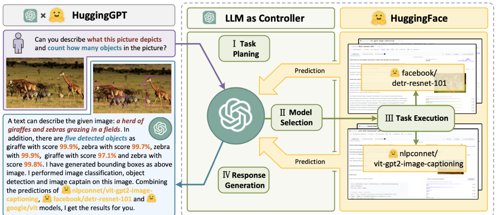
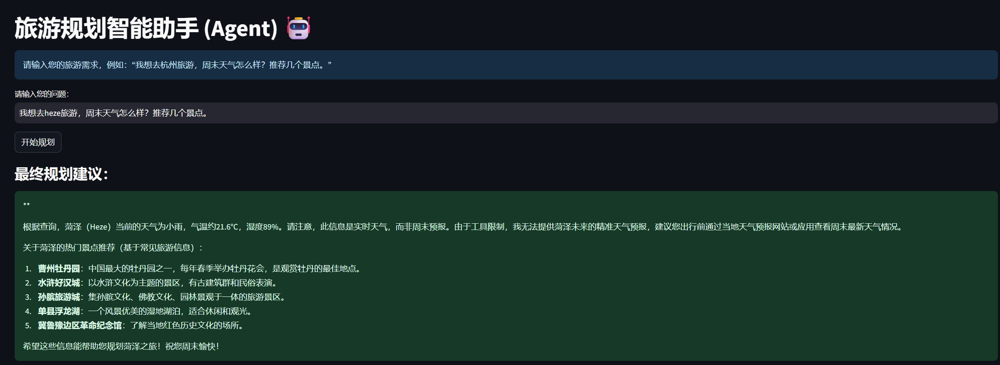
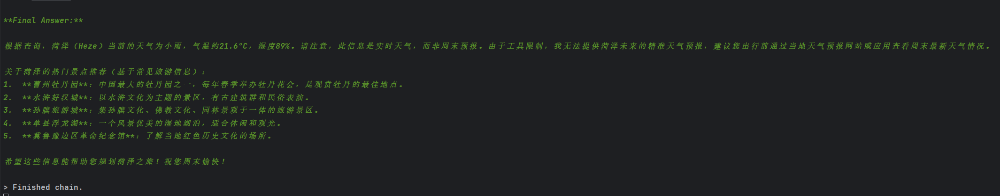

# 旅游规划智能助手 (AI Travel Planner Agent)

[](https://www.python.org/downloads/)
[](https://streamlit.io)
[](https://www.langchain.com/)
[](https://opensource.org/licenses/MIT)

这是一个基于 LangChain Agents 构建的旅游规划智能助手。它能够理解用户的自然语言需求，自主规划任务步骤，并智能调用外部工具（如天气和地图API）来获取实时信息，最终为用户生成一份结合了天气情况的、合理的旅游行程建议。

## 📝 项目背景
传统的旅游规划需要用户在多个应用（如天气App、地图App、旅游攻略网站）之间来回切换，信息整合效率低下。本项目旨在构建一个“一站式”的智能规划助理，模拟人类专家的思考方式，自动化地完成信息检索、分析和行程规划的全过程，提升规划效率和智能化水平。

## ⚙️ Agent 工作流
本项目的核心是 `ZERO_SHOT_REACT_DESCRIPTION` 类型的 Agent，它遵循 **ReAct (Reason + Act)** 的思考框架。当接收到用户请求后，它的工作流程如下：

[]

**用户输入 -> [Thought] LLM思考分析任务 -> [Action] LLM决定使用工具 -> [Action Input] LLM确定工具输入 -> 调用工具API -> [Observation] 获取工具返回结果 -> [Thought] LLM根据新信息继续思考 -> ... (循环) -> [Final Answer] LLM得出最终结论**

## 🛠️ 技术栈
* **Web框架**: [Streamlit](https://streamlit.io/) - 用于构建可交互的前端Web界面。
* **AI Agent框架**: [LangChain Agents](https://python.langchain.com/docs/modules/agents/) - 负责实现 Agent 的思考循环、工具调用和最终决策。
* **大语言模型 (LLM)**: [豆包大模型 (Doubao API)](https://www.doubao.com/ark) - 作为 Agent 的“大脑”，负责理解任务和进行推理。
* **外部工具 (Tools)**:
    * **天气查询**: [OpenWeatherMap API](https://openweathermap.org/api) - 用于获取指定城市的实时天气。
    * **景点查询**: [高德地图 Web 服务 API](https://lbs.amap.com/) - 用于查询指定城市的POI（兴趣点）信息，如热门景点。

## 🚀 快速开始

### 1. 克隆仓库
```bash
git clone [https://github.com/jianchuang476-netizen/fjc.git]
cd AI-Travel-Agent
```

### 2. 创建并激活虚拟环境 (推荐)
```bash
python -m venv venv
# Windows
venv\Scripts\activate
# macOS / Linux
source venv/bin/activate
```

### 3. 安装依赖
请确保项目根目录中包含 `requirements.txt` 文件。
```bash
pip install -r requirements.txt
```
> **提示**: 您可以通过在终端运行 `pip freeze > requirements.txt` 来生成此文件。

### 4. 配置API Key
在 `agent_app.py` 文件的头部，找到并替换以下所有密钥占位符：
* `YOUR_ARK_API_KEY` (豆包 API Key)
* `YOUR_OPENWEATHERMAP_API_KEY` (OpenWeatherMap API Key)
* `AMAP_API_KEY` (高德地图 API Key)

### 5. 启动应用
```bash
streamlit run agent_app.py
```
启动后，浏览器将自动打开应用界面。

## 效果展示
[]

**问答示例:**

> **用户问题**: `我想去菏泽旅游，周末天气怎么样？推荐几个景点。`
>
> **Agent 最终回答**: `根据查询，菏泽（Heze）当前的天气为小雨，气温约21.6°C，湿度89%。请注意，此信息是实时天气，而非周末预报。由于工具限制，我无法提供菏泽未来的精准天气预报，建议您出行前通过当地天气预报网站或应用查看周末最新天气情况。
关于菏泽的热门景点推荐（基于常见旅游信息）：
曹州牡丹园：中国最大的牡丹园之一，每年春季举办牡丹花会，是观赏牡丹的最佳地点。
水浒好汉城：以水浒文化为主题的景区，有古建筑群和民俗表演。
孙膑旅游城：集孙膑文化、佛教文化、园林景观于一体的旅游景区。
单县浮龙湖：一个风景优美的湿地湖泊，适合休闲和观光。
冀鲁豫边区革命纪念馆：了解当地红色历史文化的场所。
希望这些信息能帮助您规划菏泽之旅！祝您周末愉快！`

**终端思考过程示例:**

```

## 🔮 待优化方向
* **增加工具多样性**: 集成酒店查询、机票/火车票查询等更多API，使规划能力更全面。
* **引入记忆功能**: 为 Agent 增加记忆模块，使其能够处理更复杂的、需要上下文理解的多轮对话规划。
* **Agent 鲁棒性优化**: 对工具的 `description` 进行更精细的打磨，并引入更强的错误处理机制，提高 Agent 在面对模糊指令或API故障时的表现。

## 📄 许可证
本项目采用 [MIT License](https://opensource.org/licenses/MIT) 开源。

## 📧 联系方式
[冯] - [fjc862825125@163.com]