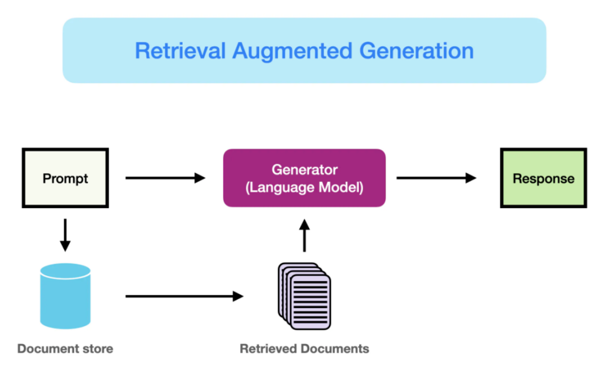
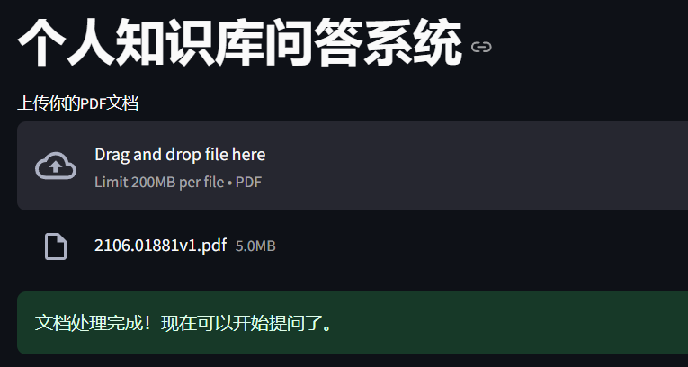
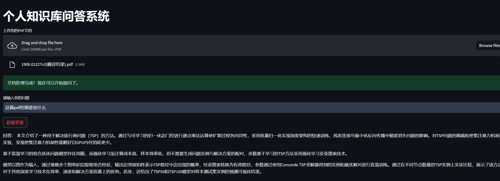

# 个人知识库问答系统 (Personal RAG Q&A System)

[](https://www.python.org/downloads/)
[](https://streamlit.io)
[](https://www.langchain.com/)
[](https://opensource.org/licenses/MIT)

这是一个基于检索增强生成（RAG）技术的个人知识库问答系统。用户可以上传自己的私有文档（PDF格式），系统会基于文档内容，精准地回答用户提出的问题，有效解决了通用大语言模型无法理解特定领域知识的痛点 。

## 📝 项目背景
通用大语言模型（LLM）虽然知识渊博，但对于未曾学习过的私有知识（如个人学习笔记、公司内部文档、项目报告等）一无所知，并且容易产生事实幻觉 。本项目旨在构建一个能与用户私有知识库进行深度对话的智能AI助手，确保所有回答均基于原文，实现高精度的信息检索与问答。

## ⚙️ 项目流程图
本项目遵循经典的 RAG 架构，核心流程如下：

[]

[cite_start]**文本处理 -> 文档加载 -> 文本分割 -> 文本向量化 -> 存入向量数据库 -> 用户提问 -> 向量检索 -> 构建Prompt -> LLM生成回答 -> 返回用户** 

## 🛠️ 技术栈
本项目的实现依赖于一系列开源工具和API：

* **Web框架**: [Streamlit](https://streamlit.io/)  - 用于快速构建可交互的前端Web界面。
* **AI编排框架**: [LangChain](https://www.langchain.com/)  - 负责连接LLM、向量数据库等组件，构建完整的RAG流程。
* **向量化模型**: [Sentence-BERT (all-MiniLM-L6-v2)](https://huggingface.co/sentence-transformers/all-MiniLM-L6-v2)  - 一个轻量且高效的文本嵌入模型，用于将文本转换为向量。
* **向量数据库**: [FAISS (Facebook AI Similarity Search)](https://github.com/facebookresearch/faiss)  - 用于在本地高效地存储和检索向量。
* **大语言模型 (LLM)**: [豆包大模型 (Doubao API)](https://www.doubao.com/ark)  - 作为后端的大脑，负责理解用户问题和检索到的内容，并生成最终答案。

## 🚀 快速开始

### 1. 克隆仓库
```bash
git clone [https://github.com/jianchuang476-netizen/fjc.git]
cd personal-rag-qa-system
```

### 2. 创建并激活虚拟环境 (推荐)
```bash
python -m venv venv
# Windows
venv\Scripts\activate
# macOS / Linux
source venv/bin/activate
```

### 3. 安装依赖
建议您先创建一个 `requirements.txt` 文件，然后运行：
```bash
pip install -r requirements.txt
```
> **提示**: 您可以在项目目录中通过运行 `pip freeze > requirements.txt` 来生成此文件。

### 4. 配置API Key
在代码 `app.py` 文件中，找到并替换以下占位符：
```python
# --- 豆包方舟平台 LLM 配置 ---
OPENAI_API_KEY = "YOUR_ARK_API_KEY" # <--- 在这里填入你的豆包API Key
```

### 5. 启动应用
```bash
streamlit run app.py
```
启动后，浏览器将自动打开应用界面。

## 效果展示

[]

[cite_start]**问答示例:** [cite: 1]

> **用户问题**: [这篇pdf的摘要是什么]
>
> **模型回答**: [本文介绍了一种用于解决旅行商问题（TSP）的方法。通过与可学习的归一化边门控进行逐点乘法运算使扩散过程各向异性，采用批量归一化实现深度架构的快速训练，残差连接可最小化反向传播中梯度消失问题的影响。对TSP问题的稀疏和密集注意力机制进行实验，发现密集注意力机制性能略好且GPU内存消耗更少。
基于监督学习的组合优化问题模型存在局限，而强化学习虽计算成本高、样本效率低，但不需要生成问题实例与解决方案的配对，多数基于学习的TSP方法采用强化学习及束搜索技术。
模型以图作为输入，通过堆叠多个图卷积层提取组合特征，输出边邻接矩阵表示TSP路径中边出现的概率，经束搜索转换为有效路径，参数通过使用Concorde TSP求解器得到的实例和最优解对进行监督训练。通过在不同节点数量的TSP实例上实证比较，展示了该方法相对于其他深度学习技术在效率、速度和解决方案质量上的优势。此外，还给出了TSP50和TSP100模型对样本测试集实例的预测可视化结果。]

## 🔮 待优化方向
本项目作为一个快速原型，未来还有许多可优化的方向：

* **优化文档分割策略**: 尝试基于Markdown标题或PDF目录的智能分割，以提升检索上下文的完整性。
* **尝试更先进的检索算法**: 集成如`MultiQueryRetriever`或`HyDE`等更复杂的检索策略，提升复杂问题的检索精度。
* **支持更多文档格式**: 增加对Word、TXT、HTML等更多文件格式的支持。
* **增加对话历史记忆**: 引入`ConversationBufferMemory`，使问答系统能够理解多轮对话的上下文。

## 📄 许可证
本项目采用 [MIT License](https://opensource.org/licenses/MIT) 开源。

## 📧 联系方式
[冯] - [fjc862825125@163.com]